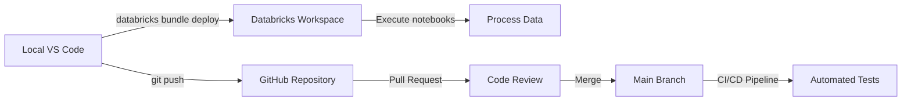

# 🔧 Development Environment Setup

Complete guide to configure Databricks, Visual Studio Code, and GitHub integration for this project.

---

## 📋 Table of Contents

1. [Prerequisites](#prerequisites)
2. [Databricks Configuration](#databricks-configuration)
3. [Visual Studio Code Setup](#visual-studio-code-setup)
4. [GitHub Integration](#github-integration)
5. [Workflow Summary](#workflow-summary)
6. [Troubleshooting](#troubleshooting)

---

## 🛠️ Prerequisites

### Required Software
- **Python 3.8+** ([Download](https://www.python.org/downloads/))
- **Visual Studio Code** ([Download](https://code.visualstudio.com/))
- **Git** ([Download](https://git-scm.com/downloads))
- **Databricks Account** ([Sign up](https://databricks.com/try-databricks))

### Required VS Code Extensions
```
databricks.databricks
ms-python.python
ms-toolsai.jupyter
```

---

## 🧱 Databricks Configuration

### Step 1: Install Databricks CLI

```bash
# Using pip
pip install databricks-cli

# Verify installation
databricks --version
```

### Step 2: Generate Personal Access Token

1. Navigate to your Databricks workspace:
   ```
   https://dbc-fd5c2cc6-9b83.cloud.databricks.com
   ```

2. Click on your **user icon** (top right) → **User Settings**

3. Go to **Developer** tab → **Access Tokens**

4. Click **"Generate New Token"**
   - **Comment:** `VS Code Integration`
   - **Lifetime:** 90 days (or custom)

5. **Copy the token** immediately (you won't see it again!)

### Step 3: Configure Databricks CLI

```bash
# Run configuration command
databricks configure --token

# You'll be prompted for:
# - Databricks workspace host: https://dbc-fd5c2cc6-9b83.cloud.databricks.com
# - Personal access token: [paste your token]
```

**Configuration File Location:**
- **Windows:** `C:\Users\<YourUsername>\.databrickscfg`
- **macOS/Linux:** `~/.databrickscfg`

**Example `.databrickscfg` content:**
```ini
[DEFAULT]
host = https://dbc-fd5c2cc6-9b83.cloud.databricks.com
token = dapi1234567890abcdefghijklmnopqrstuvwxyz
```

### Step 4: Test Connection

```bash
# List your workspace
databricks workspace list /Users/diego.mayorgacapera@gmail.com

# Expected output:
# ID                Type       Language  Path
# 2402287963537530  DASHBOARD            /Users/diego.mayorgacapera@gmail.com/...
# ...
```

### Step 5: Configure Databricks Bundle

The project uses **Databricks Asset Bundles** for deployment:

**File:** `databricks.yml`
```yaml
bundle:
  name: BI_Market_Visibility

targets:
  dev:
    mode: development
    default: true
    workspace:
      host: https://dbc-fd5c2cc6-9b83.cloud.databricks.com
```

**Validate bundle:**
```bash
databricks bundle validate

# Expected output:
# Name: BI_Market_Visibility
# Target: dev
# Workspace:
#   Host: https://dbc-fd5c2cc6-9b83.cloud.databricks.com
#   User: diego.mayorgacapera@gmail.com
#   Path: /Workspace/Users/diego.mayorgacapera@gmail.com/.bundle/...
# Validation OK!
```

**Deploy to Databricks:**
```bash
# Deploy your local project to Databricks workspace
databricks bundle deploy

# Files will be uploaded to:
# /Workspace/Users/diego.mayorgacapera@gmail.com/.bundle/BI_Market_Visibility/dev/files/
```

---

## 💻 Visual Studio Code Setup

### Step 1: Install Required Extensions

Open VS Code and install:

1. **Databricks Extension**
   ```
   ext install databricks.databricks
   ```

2. **Python Extension**
   ```
   ext install ms-python.python
   ```

3. **Jupyter Extension**
   ```
   ext install ms-toolsai.jupyter
   ```

### Step 2: Configure Databricks Extension

1. Open **Command Palette** (`Ctrl+Shift+P` / `Cmd+Shift+P`)

2. Search: **"Databricks: Configure"**

3. Select **"Use existing .databrickscfg"**
   - The extension will auto-detect your configuration from Step 2.3

4. Verify connection:
   - Click the **Databricks icon** in the left sidebar
   - You should see your workspace structure

### Step 3: Configure Workspace Settings

**File:** `.vscode/settings.json`
```json
{
    // Databricks notebook cell markers
    "jupyter.interactiveWindow.cellMarker.codeRegex": "^# COMMAND ----------|^# Databricks notebook source|^(#\\s*%%|#\\s*\\<codecell\\>|#\\s*In\\[\\d*?\\]|#\\s*In\\[ \\])",
    "jupyter.interactiveWindow.cellMarker.default": "# COMMAND ----------",
    
    // Show files ignored by .gitignore in explorer
    "explorer.excludeGitIgnore": false,
    "search.useIgnoreFiles": false,
    
    // Python configuration
    "python.analysis.typeCheckingMode": "basic",
    "python.linting.enabled": true,
    "python.linting.flake8Enabled": true,
    "python.formatting.provider": "black",
    
    // File formatting
    "[python]": {
        "editor.formatOnSave": true,
        "editor.codeActionsOnSave": {
            "source.organizeImports": true
        }
    }
}
```

### Step 4: Configure Python Environment

```bash
# Create virtual environment
python -m venv venv

# Activate (Windows)
.\venv\Scripts\activate

# Activate (macOS/Linux)
source venv/bin/activate

# Install dependencies
pip install -r requirements.txt
```

### Step 5: Databricks Workspace Navigation in VS Code

**Accessing Databricks Files:**

1. Click **Databricks icon** (left sidebar)
2. Navigate through:
   - **Workspace:** Your notebooks and folders
   - **DBFS:** Databricks File System
   - **Clusters:** Available compute clusters
   - **Jobs:** Scheduled jobs

**Syncing Local ↔ Databricks:**
```bash
# Upload local changes to Databricks
databricks bundle deploy

# List remote files
databricks workspace list /Workspace/Users/diego.mayorgacapera@gmail.com/.bundle/BI_Market_Visibility/dev/files

# Download specific file from Databricks
databricks workspace export /Workspace/Users/.../notebook.py ./local_notebook.py
```

---

## 🐙 GitHub Integration

### Step 1: Initialize Git Repository

```bash
# Navigate to project directory
cd D:\Projects\BI_Market_Visibility

# Initialize Git
git init

# Configure user (if not configured globally)
git config user.name "Diego Mayor"
git config user.email "diego.mayorgacapera@gmail.com"

# Verify configuration
git config --list
```

### Step 2: Configure .gitignore

**Key exclusions for Databricks + Data projects:**

```gitignore
# Python artifacts
__pycache__/
*.py[cod]
.pytest_cache/

# Virtual environments
venv/
.venv/

# Data files (exclude large datasets, keep samples)
*.csv
*.parquet
!*_sample.csv
!data/raw/**/master_pdv_raw.csv

# Databricks
.databricks/
*.dbfs

# Credentials
.env
.databrickscfg
credentials.json

# IDE
.vscode/
.idea/

# Power BI
*.pbix.tmp
```

### Step 3: Create GitHub Repository

**Option A: Using GitHub CLI**
```bash
# Install GitHub CLI (if not installed)
winget install GitHub.cli

# Authenticate
gh auth login

# Create repository
gh repo create BI_Market_Visibility --public --source=. --remote=origin --push
```

**Option B: Manual Creation**
1. Go to: https://github.com/new
2. Repository name: `BI_Market_Visibility`
3. Visibility: **Public**
4. ❌ Don't initialize with README (you already have one)
5. Click **"Create repository"**

### Step 4: Connect Local Repository to GitHub

```bash
# Add remote
git remote add origin https://github.com/DIEGO77M/BI_Market_Visibility.git

# Verify remote
git remote -v

# Rename default branch to main
git branch -M main

# Stage all files
git add .

# Initial commit
git commit -m "Initial commit: Project structure with Databricks integration"

# Push to GitHub
git push -u origin main
```

### Step 5: Branch Strategy

```bash
# Create development branch
git checkout -b develop
git push -u origin develop

# For new features
git checkout -b feature/feature-name
git add .
git commit -m "feat: Add new feature"
git push -u origin feature/feature-name

# Create Pull Request on GitHub
# feature/feature-name → develop → main
```

### Step 6: Enable Branch Protection

**GitHub Web UI:**
1. Go to: **Settings** → **Branches**
2. Click **"Add branch protection rule"**
3. Branch name pattern: `main`
4. Enable:
   - ✅ Require pull request before merging
   - ✅ Require status checks to pass
   - ✅ Require conversation resolution
5. Save changes

---

## 🔄 Workflow Summary

### Daily Development Workflow



### Complete Integration Flow

1. **Develop Locally (VS Code)**
   ```bash
   # Edit notebooks, Python modules
   code notebooks/01_bronze_ingestion.py
   ```

2. **Deploy to Databricks**
   ```bash
   databricks bundle deploy
   ```

3. **Execute in Databricks**
   - Run notebooks with cluster compute
   - Process data through Bronze → Silver → Gold layers

4. **Version Control (Git)**
   ```bash
   git checkout -b feature/new-transformation
   git add .
   git commit -m "feat: Add sales aggregation logic"
   git push origin feature/new-transformation
   ```

5. **Collaborate (GitHub)**
   - Create Pull Request
   - Code review
   - CI/CD tests run automatically
   - Merge to main

---

## 🔍 Troubleshooting

### Common Issues

#### 1. Databricks CLI Connection Failed

**Error:** `Error: Invalid authentication credentials`

**Solution:**
```bash
# Regenerate token in Databricks UI
# Reconfigure CLI
databricks configure --token

# Test connection
databricks workspace list /Users/diego.mayorgacapera@gmail.com
```

#### 2. VS Code Not Showing Databricks Files

**Error:** Files in `.gitignore` not visible

**Solution:** Update `.vscode/settings.json`:
```json
{
    "explorer.excludeGitIgnore": false,
    "search.useIgnoreFiles": false
}
```

#### 3. Bundle Deploy Fails

**Error:** `Error: Path does not exist`

**Solution:**
```bash
# Validate bundle configuration
databricks bundle validate

# Check databricks.yml syntax
# Ensure host URL is correct
```

#### 4. Git Push Rejected (Protected Branch)

**Error:** `remote: error: GH006: Protected branch update failed`

**Solution:**
```bash
# Create feature branch
git checkout -b feature/your-changes

# Push feature branch
git push origin feature/your-changes

# Create Pull Request on GitHub
```

#### 5. Python Environment Issues

**Error:** `ModuleNotFoundError: No module named 'pyspark'`

**Solution:**
```bash
# Activate virtual environment
.\venv\Scripts\activate  # Windows
source venv/bin/activate  # macOS/Linux

# Reinstall dependencies
pip install -r requirements.txt
```

---

## 📚 Additional Resources

### Official Documentation
- [Databricks CLI Reference](https://docs.databricks.com/dev-tools/cli/index.html)
- [Databricks VS Code Extension](https://marketplace.visualstudio.com/items?itemName=databricks.databricks)
- [GitHub Git Guides](https://github.com/git-guides)
- [VS Code Python Tutorial](https://code.visualstudio.com/docs/python/python-tutorial)

### Useful Commands Cheat Sheet

**Databricks:**
```bash
databricks workspace list <path>           # List files
databricks bundle validate                 # Validate config
databricks bundle deploy                   # Deploy project
databricks fs ls dbfs:/path                # List DBFS files
```

**Git:**
```bash
git status                                 # Check changes
git add .                                  # Stage all
git commit -m "message"                    # Commit
git push origin <branch>                   # Push to remote
git pull origin <branch>                   # Pull changes
git checkout -b <branch>                   # New branch
```

**Python:**
```bash
python -m venv venv                        # Create virtual env
pip install -r requirements.txt            # Install deps
pytest src/tests/                          # Run tests
black src/                                 # Format code
flake8 src/                                # Lint code
```

---

## ✅ Verification Checklist

Use this checklist to verify your setup:

- [ ] Databricks CLI installed and configured
- [ ] Personal access token generated and stored in `.databrickscfg`
- [ ] VS Code Databricks extension installed and connected
- [ ] Python virtual environment created and activated
- [ ] All dependencies installed from `requirements.txt`
- [ ] Git repository initialized and connected to GitHub
- [ ] `.gitignore` configured to exclude sensitive files
- [ ] Branch protection enabled on `main` branch
- [ ] CI/CD pipeline configured with GitHub Actions
- [ ] Successfully deployed bundle to Databricks workspace
- [ ] Can navigate Databricks workspace from VS Code sidebar

---

**🎉 Setup Complete!** You're now ready to develop end-to-end data pipelines with seamless integration between Databricks, VS Code, and GitHub.

For questions or issues, refer to the [Troubleshooting](#troubleshooting) section or open an issue on GitHub.
