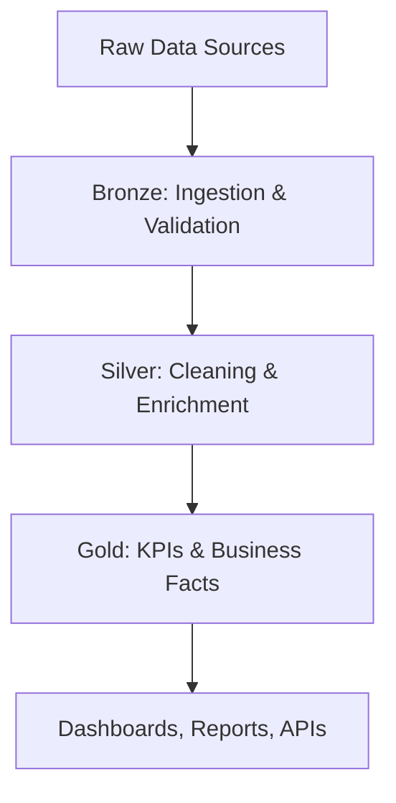

# Project Architecture

> High-level overview of the BI Market Visibility solution, following Medallion Architecture and Databricks best practices.

---

## Architecture at a Glance

**Sources → Ingestion → Transformation → Serving → Consumption**

- **Sources:** Retail/FMCG operational systems, price audits, sell-in, master data
- **Ingestion:** Bronze layer (raw, auditable, technical validation)
- **Transformation:** Silver layer (cleaning, deduplication, business rules, enrichment)
- **Serving:** Gold layer (KPI facts, executive-ready datasets, validation metrics)
- **Consumption:** Dashboards, reports, APIs for Commercial, RGM, and BI teams

---

## Key Design Decisions

| Decision              | Reason                  | Business Trade-off           |
|----------------------|------------------------|------------------------------|
| Batch processing     | Cost predictability     | Higher latency               |
| Dimensional model    | Faster analytics        | ETL complexity               |
| Delta Lake           | ACID, time travel, scale| Vendor lock-in               |
| Serverless Databricks| Scalability, simplicity | Less control over infra      |

---

## Core Outputs

- Executive KPI Dashboards
- Finance-ready datasets
- Analytics API for downstream teams

---

## Layered Data Flow (Mermaid)

---

## Documentation

- [Data Dictionary](../data_dictionary/README.md)
- [Technical Specs](../technical_specs/README.md)

---

## License

MIT
