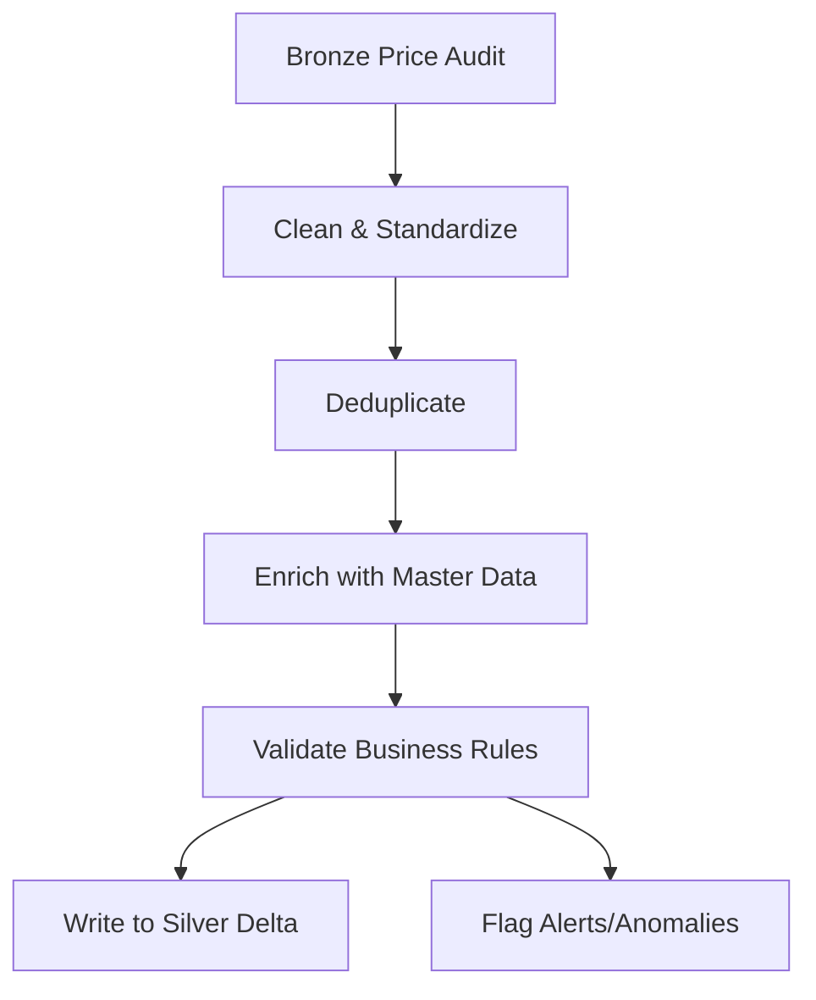

# Silver Layer – Price Audit Example

> **Purpose:** Business-ready, standardized, and enriched data for advanced analytics and KPI modeling. Example: Price Audit Silver Table.

---

## 🚀 Quick Facts

- ⏱️ Full Silver pipeline runs in: **1–2 minutes**
- 🏗️ Strict Medallion Architecture: Bronze → Silver → Gold
- 📦 100% Delta Lake, Databricks Serverless compatible
- 🧹 Cleansed, deduplicated, and business-rule validated data
- 🛡️ Controlled enrichment and partition optimization

---

## 📊 What is the Silver Layer?

The Silver layer transforms raw Bronze data into business-consumable, quality-assured datasets. Key responsibilities:

- **Cleaning & Standardization:** Normalize dates, correct data types, unify formats
- **Deduplication:** Remove technical and business duplicates
- **Business-impact Quality Rules:** Validate keys, flag outliers, enforce referential integrity
- **Controlled Enrichment:** Add calculated fields, join with master data, and (optionally) geolocation
- **Partition Optimization:** Prepare for efficient downstream analytics

---

## 🗂️ Structure (Example: Price Audit)

| Folder             | Purpose                              |
|--------------------|--------------------------------------|
| fact_price_audit/  | Silver fact table for price audit    |
| fact_sell_in/      | Silver fact table for sell in        |
| dimension_products/| Product dimension (enriched)         |
| dimension_pdv/     | Point-of-sale dimension (enriched)   |
| notebooks/         | Orchestration notebooks (Databricks) |

---

## 🧩 Key Transformations (Price Audit)

- **Date Normalization:** Combines year/month into a single date field for time-series analysis
- **Joins:** Enriches price audit with product and PDV master data
- **Promotion Cleaning:** Flags and corrects cases where promotional price is higher than regular price
- **Geolocation Handling:**
    - Coordinates in this dataset are simulated (not real) for demonstration purposes
    - If real coordinates were available, geospatial analytics (e.g., clustering, mapping) could be enabled
    - Invalid or missing coordinates are flagged and excluded from geospatial calculations
- **Business Alerts:**
    - The alert for 'promotional price greater than regular price' is intentionally generated to validate error detection logic and ensure robust data quality monitoring

---

## 🛠️ Pipeline Flow (Silver)

1. **Read from Bronze:** Ingest only from validated Bronze Delta tables
2. **Clean & Standardize:** Apply business-impact cleaning and normalization
3. **Deduplicate:** Remove duplicates based on business keys
4. **Enrich:** Join with master data, add calculated fields (e.g., price index)
5. **Validate:** Apply business rules, flag anomalies (e.g., promo price > price)
6. **Write to Silver:** Store in Silver schema, partitioned for analytics

---

## 📈 Quality & Monitoring


### Table-level Auditing & Monitoring

- **Automated Quality Checks:**
    - Each Silver table (fact and dimension) is subject to a suite of business-impact quality rules: key validation, referential integrity, outlier detection, and business logic exceptions.
    - All results (pass/fail, row counts, anomaly details) are written to dedicated Delta tables for traceability and downstream alerting.

- **Drift Detection:**
    - Schema and distribution drift are monitored on every load. Unexpected changes in structure or value distributions trigger alerts, supporting proactive data governance.

- **Alerting:**
    - Business rule violations (e.g., promotional price > price, invalid coordinates) are flagged at row level and summarized in monitoring tables. No data is dropped—issues are visible for root-cause analysis.

### Orchestration & Validation

- **Orchestrator Notebooks:**
    - Each Silver pipeline is orchestrated via Databricks notebooks, ensuring deterministic, idempotent, and auditable runs.
    - The orchestrator executes each table's transformation, then triggers its validation and monitoring scripts in sequence.
    - If any table fails a critical quality check, the orchestrator logs the error and can halt downstream processing, ensuring only trusted data flows to Gold.

- **Validation Flow Example:**

    ```mermaid
    graph TD;
        A[Start Orchestrator] --> B[Run fact_price_audit Transformation]
        B --> C[Run fact_price_audit Validation]
        C --> D[Run fact_price_audit Monitoring]
        D --> E[Run dimension_products Transformation]
        E --> F[Run dimension_products Validation]
        F --> G[Run dimension_products Monitoring]
        G --> H[Continue with other tables...]
        H --> I[Summarize Results & Alerts]
    ```

> This approach ensures every Silver table is not only transformed, but also fully audited and monitored, with results available for business and technical stakeholders.

---

## 📚 Documentation

- [Project Architecture](../../docs/architecture/)
- [Data Dictionary](../../docs/data_dictionary/)
- [Technical Specs](../../docs/technical_specs/)

---

## 📝 Example: Silver Transformation Flow (Mermaid)



---

## 💡 Why This Matters (for Recruiters)

- **Business-ready data:** Silver tables are the foundation for KPIs and executive dashboards
- **Real-world error handling:** Simulated and flagged errors demonstrate robust data quality practices
- **Geospatial readiness:** Structure supports future geolocation analytics with real coordinates
- **Portfolio-ready:** Shows senior-level BI engineering, not academic prototypes

---

## License

MIT
